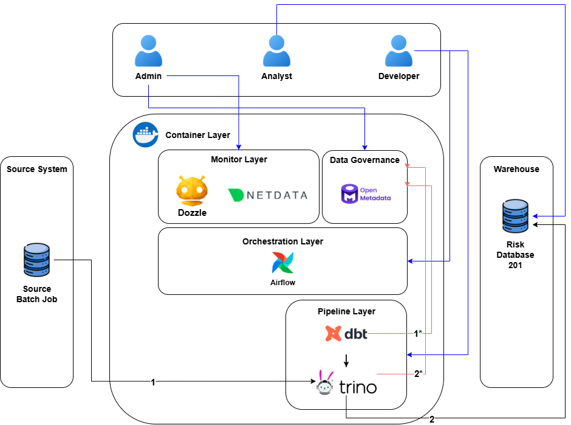

# Analytical-Data-Stack

## Overview

This project is a **production-ready template** for building a simple yet modern analytical data platform.  
It demonstrates how to deploy, orchestrate, and manage a complete data stack with **Airflow, DBT, Trino, OpenMetaData, and GitLab CI/CD**.

## Data Architecture Diagram

<div align="center">
  
</div>

### Data Flow

1. Source System Input
2. write processed data to Risk Database 201

### Metadata Flow

1\*. ingest Model Metadata from DBT to OpenMetaData <br>
2\*. ingest Source/Target Metadata from Trino to OpenMetaData

### Stakeholders

- **Admin**: Admin can monitor metrics and logs from NetData and Dozzle, Data governing from OpenMetaData
- **Analyst**: Analyst can access cleaned Data in Risk Database 201
- **Developer**: Developer can develop pipeline in Pipeline Layer, schedule jobs in Orchestration Layer

## Deployment and Instruction

### Airflow

- All config inside Airflow/docker-compose.yml and Airflow/Dockerfile
- up.sh with automatically create admin user, set airflow container user as system-user

### DBT

- config target catalog and database inside profiles/profiles.yml (All projects use only one profile file)
- config source for XHTD at DBT/projects/XHTD/models/staging/sources.yml and DBT/projects/XHTD/models/staging/schema.yml

### Dozzle

- specify AGENT_IP at Monitors\Dozzle\docker-compose-main.yml
- change AGENT_IP, and SYSTEM_USER in Monitors\Dozzle\up.sh and Monitors\Dozzle\down.sh

### NetData

- Only need to set parent IP in child config

### OpenMetaData

- only change service name in OpenMetaData/config/XHTD/\*.yml if needed
- create service with service name as same as set in above \*.yml files, with Trino type, username and password, host (trino:8080 by default), Auth Configuration Type Basic Auth

### Trino

- Use can choose to setup SSL or regular network between coordinator and workers
- setup connectors in `trino/trino-coordinator/etc/catalog`
- there are container specs in `trino/trino-coordinator/etc/config.properties`

### Full_stack deployment

```bash
bash -x up_full_flow.sh
```

### Take down full flow

```bash
bash -x down_full_flow.sh
```

## Airflow DAG

- Stored in Airflow/dags
- Airflow log stored in host disk in Airflow/logs
- Each DAG call multiple DBT models
- Each model contains at least 3 task `dbt run`, `dbt test` and `dbt docs generate`

## DBT models

- dbt-cores and its dependencies installed directly inside Airflow Environment.
- Dbt models Stored in DBT/project/project_name/models
- DBT log stored in host disk in DBT/projects/logs
- Each model produce a separate target folder for metadata (from `dbt docs generate`) and run_result (from `dbt test`) (see DAGs for more detail)
- DBT model pattern split a ETL into 3 steps:
  - Staging: mainly focus on select, and filter (for smaller table) and may contain simple data type conversion
  - Intermediate: input from Staging, mainly focus on join, union and single columns transformation
  - Fact: input from Intermediate, mainly focus on aggregation, format model (snapshot or incremental table), join from Intermediate and multiple columns transformation.

## OpenMetaData

- This a dedicated Metadata analytics and Visuallization tool (Data Quality, Data Lineage, ...)
- Create a service and point the exact `serviceName` in ingest \*.yml files
- It require to ingest MetaData every DAGs run
- Always generate docs before ingest data to OpenMetaData
- Normally, There are at least 4 Task run in a DAG
  - Ingest source tables MetaData (go throught Trino)
  - Ingest models Profiler (go throught Trino)
  - Ingest models Classification (go throught Trino)
  - Ingest models DBT MetaData (specify for each project in folder OpenMetaData/config/[project_name])
- Specify filter in each \*.yml file for cleaner visuallization.

## Init new DBT project

- You MUST init new dbt project once in your local

```bash
dbt init [project_name] --skip-profile-setup
```

- then add new config profile of that project in DBT/profiles/profiles.yml
- then push to git (Best Practice)

## Endpoints and UIs

- Dozzle: `http://localhost:8888/`
- Airflow: `http://localhost:1234/`
- OpenMetaData: `http://localhost:8585/`
- NetData: `http://localhost:19999/`
- Trino: `https://localhost:9043/ui/login.html`

## CI/CD

- A in process gitlab runner (not a separate container as a gitlab runner) is need for CI/CD. Since The deployment process will include copy files into production server and initiallize containers

### Deployments Once Gitlab CI running

- create a branch name "System-deploy" to deploy the whole stack
- branch name "main" to deploy the whole DAGs and DBT model only

## Requirements

- Docker permission (with Docker preinstall)
- rsync (to copy files)
- ssh keys to connect to another Node (for Trino-worker, if any)
- install dbt python (please create a venv for gitlab-runner to avoid break the system's python)

```bash
pip install dbt-core
```

### Deployments

- create a branch name "System-deploy" to deploy the whole stack
- branch name "main" to deploy the whole DAGs and DBT model only

## Config Note

- DBT inside Airflow docker-compose
- only Airflow by user which is run from Gitlab-runner (the user of Gitlab-runner is the user of Airflow inside)
- Config DBT in profiles for connection
- Config OpenMetaData in OpenMetaData/config
- PLEASE KEEP ALL VERSION OF PYTHON PACKAGE INSIDE AIRFLOW STATIC (OR IT WILL EASILY BREAK)

# Author

Huynh Hoang Trung Nghia
